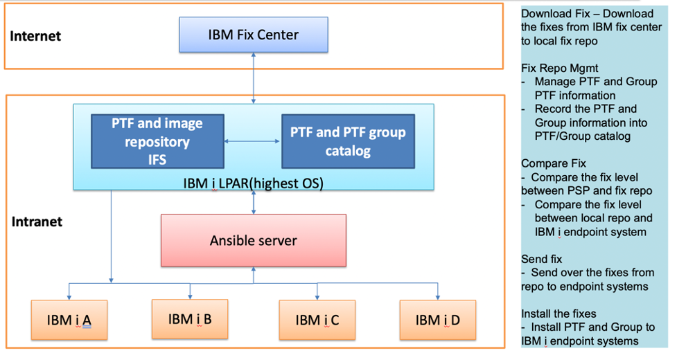
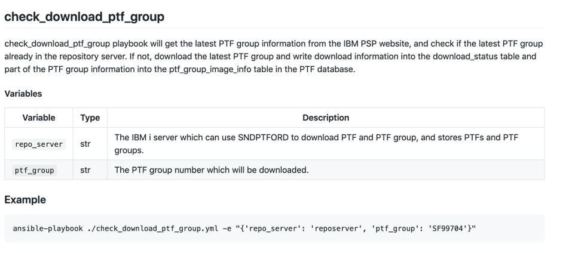
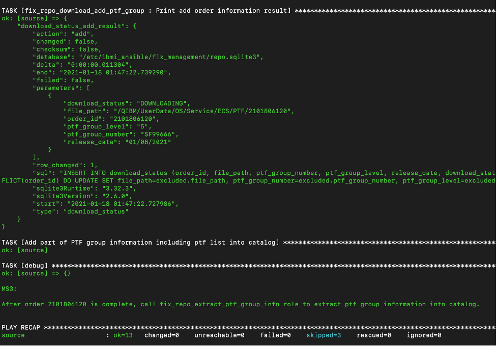
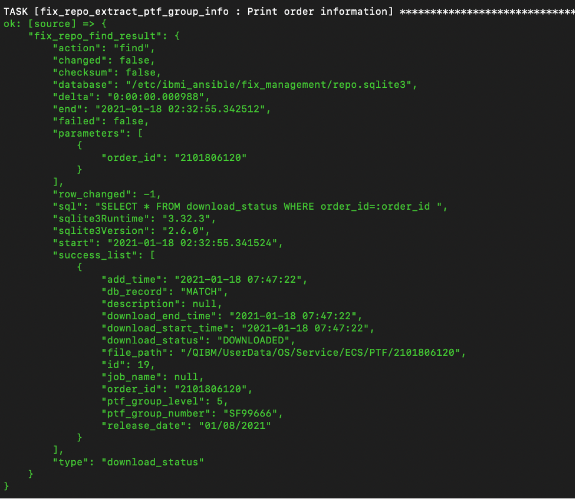

Starting from IBM i Ansible collections version 1.2.0, more fix management related functions have been released. This article describes what functions are out there and how you could leverage them for your PTF/PTF group management automation work. 

# Introduction
Ansible for IBM i collections not only give you building blocks to enable your basic operations and tasks, but also provide solution level modules and playbooks which aim at solving specific use cases. Such solution level items can be used directly or be modified and orchestrated for your own scenarios. One of the use cases that our customers always ask for is automation for fix management. For IBM i, managing the fixes in the format of PTF and PTF Group are quite manual operations for large, medium and small customers. If the customer manages quite a few IBM i systems, it will become complex work to manage and track the status of the PTF/PTF Group on each system.

Here are some common questions that are asked frequently by our IBM i customers:
1.	How current are the PTF groups on my IBM i? Can I be notified when I’m behind?
2.	Can PTFs / PTF groups be automatically downloaded to my systems?
3.	I have 20+ IBM i systems, is there a better way to install PTF / PTF groups to these systems at once?
4.	I remember that I had removed some PTFs from a particular group. Can I have an easy way to know how many PTFs in a group are installed on my system? (Sometimes, the PTFs are removed from the system due to different reasons. This would cause the PTF group level to show as ‘not installed’. From security compliance perspective, some groups such as hyper ones need to be the latest from IBM. Such ‘not installed’ status will fail the compliance checking even 99% percent of the PTFs in the group are actually on the system. That is why our customers want to know how many PTFs of a group are on the system. For example, if there is only one defect PTF that is not on, the compliance checking should pass.)
5.	I would like to have a way to manage all of my downloaded PTFs and groups. I also need to have a simple way to do PTF management for all of my 50+ IBM i systems. 
Now, with the support of fix management in Ansible for IBM i support, you have the capability to solve the problems mentioned above. 

# The building blocks
Before using any modules, roles, or playbook of fix management for IBM i, you need to make sure that you have your Ansible server and endpoint IBM i systems enabled to run automation tasks. The set up process can be found here: https://ibm.github.io/ansible-for-i/installation.html. 

There are several modules and roles provided to support your basic PTF management operations. Here are the descriptions of these building blocks.
<table>
  <tr>
    <td>
      Name
    </td>
    <td>
      Type
    </td>
    <td>
      Description
    </td>    
  </tr>
  <tr>
    <td>
      ibmi_display_fix
    </td>
    <td>
      Module
    </td>
    <td>
      Displays the PTF(Program Temporary Fix) information and also get the requisite PTFs information of the PTF
    </td>    
  </tr>
  <tr>
    <td>
      ibmi_download_fix
    </td>
    <td>
      Module
    </td>
    <td>
      Download fix through SNDPTFORD. Support individual PTFs, cumulative PTF package and PTF Groups
    </td>    
  </tr>   
  <tr>
    <td>
      ibmi_download_fix_status
    </td>
    <td>
      Module
    </td>
    <td>
      Check the status of the fixes being downloaded
    </td>    
  </tr>
  <tr>
    <td>
      ibmi_fix
    </td>
    <td>
      Module
    </td>
    <td>
      Install, remove or query an individual fix or a set of fixes on to IBM i system. This module requires the save file to exist on the IBM i system
    </td>    
  </tr>
  <tr>
    <td>
      ibmi_fix_compare
    </td>
    <td>
      Module
    </td>
    <td>
      Compare input PTF list with target system to see whether these PTFs are applied
    </td>    
  </tr>
  <tr>
    <td>
      ibmi_fix_group_check
    </td>
    <td>
      Module
    </td>
    <td>
      Retrieve latest PTF group information from PSP(Preventive Service Planning) website
    </td>    
  </tr>
  <tr>
    <td>
      ibmi_fix_imgclg
    </td>
    <td>
      Module
    </td>
    <td>
      Install PTFs or PTF groups to target IBM i system by image catalog. This module requires the image file to exist on the IBM i system
    </td>    
  </tr>
  <tr>
    <td>
      ibmi_fix_product_check
    </td>
    <td>
      Module
    </td>
    <td>
      Checks if the software product of a fix is installed
    </td>    
  </tr>
  <tr>
    <td>
      <a href="https://github.com/IBM/ansible-for-i/tree/1.2.1/roles/apply_all_loaded_ptfs" target="_blank">apply_all_loaded_ptfs</a>
    </td>
    <td>
      Role
    </td>
    <td>
      Apply all loaded PTFs, then perform an IPL if auto_ipl is set to true and at least one PTF requests an IPL for permanent applied or temporary applied.
    </td>    
  </tr>
  <tr>
    <td>
      <a href="https://github.com/IBM/ansible-for-i/tree/1.2.1/roles/apply_ptf" target="_blank">apply_ptf</a>
    </td>
    <td>
      Role
    </td>
    <td>
      Apply all loaded PTFs or apply a set of ptfs according to the given PTFs list, and return PTFs applied status. Then perform an IPL if auto_ipl is set to true and at least one PTF requests an IPL for permanent applied or temporary applied
    </td>    
  </tr>
  <tr>
    <td>
      <a href="https://github.com/IBM/ansible-for-i/tree/1.2.1/roles/check_ptf" target="_blank">check_ptf</a>
    </td>
    <td>
      Role
    </td>
    <td>
      Check PTFs status according to given PTFs list, and returned all the PTFs info, status, not loaded PTFs list and already loaded PTFs list
    </td>    
  </tr>
  <tr>
    <td>
      <a href="https://github.com/IBM/ansible-for-i/tree/1.2.1/roles/download_individual_ptfs" target="_blank">download_individual_ptfs</a>
    </td>
    <td>
      Role
    </td>
    <td>
      Call ibmi_download_fix module to download a list of individual ptfs, and return status
    </td>    
  </tr>  
  <tr>
    <td>
      <a href="https://github.com/IBM/ansible-for-i/tree/1.2.1/roles/load_apply_ptfs" target="_blank">load_apply_ptfs</a>
    </td>
    <td>
      Role
    </td>
    <td>
      Call load_ptf role and apply_ptfs role to load and apply a list of individual ptfs, and return status
    </td>    
  </tr> 
  <tr>
    <td>
      <a href="https://github.com/IBM/ansible-for-i/tree/1.2.1/roles/load_ptf" target="_blank">load_ptf</a>
    </td>
    <td>
      Role
    </td>
    <td>
      Load a set of ptfs according to a given ptfs' list, and return ptfs' loaded status
    </td>    
  </tr> 
  <tr>
    <td>
      <a href="https://github.com/IBM/ansible-for-i/tree/1.2.1/roles/sync_apply_individual_ptfs" target="_blank">sync_apply_individual_ptfs</a>
    </td>
    <td>
      Role
    </td>
    <td>
      Call ibmi_synchronize_files modules to transfer a list of exists ptfs to an ibm i system, then call load_apply_ptfs role to load and apply ptfs. And return the status
    </td>    
  </tr> 
  <tr>
    <td>
      <a href="https://github.com/IBM/ansible-for-i/tree/1.2.1/roles/sync_apply_ptf_group" target="_blank">sync_apply_ptf_group</a>
    </td>
    <td>
      Role
    </td>
    <td>
      Call ibmi_synchronize_files to tranfer the exists ptf group files to an ibm i system, then call ibmi_fix_imgclg to apply this ptf group. And return the result.
    </td>    
  </tr>  
</table>

With the building blocks in the above list, you could start to automate your fix management tasks by writing your own playbooks. Each role of fix management has related README document in GitHub so that you could get examples from there. For example, the link of apply_ptf role (https://github.com/IBM/ansible-for-i/tree/1.2.0/roles/apply_ptf) provides how you could write playbooks leveraging this role.   

For more information about the modules, please visit the documentation link: https://ibm.github.io/ansible-for-i/modules.html

For the usage of each role, please click the hyper link of the role names in the above table.

# More advanced fix management solution
Besides releasing the building blocks, there are several modules, roles and playbooks to help you to manage the fixes under an advanced fix management structure. The below picture shows the architecture of this solution(The related playbooks are here: https://github.com/IBM/ansible-for-i/tree/1.2.1/usecases/fix_management).



In this architecture, we introduce an infrastructure of fix repository and catalog. As you can see from above picture, there is one IBM i partition shown as light blue box that faces the internet. On this partition, there is PTF and image repository (repository in short in the article) which consists of different places to store the downloaded fixes. The checking of whether there is new group from IBM is scheduled and the download of the fixes is automated as this repository partition is able to connect to the internet. Also, there is PTF and PTF group catalog (catalog in short in this article) which is used to maintain the information of the fixes downloaded into the repository. Once the fixes have been downloaded into the repository, the catalog is updated with PTF and PTF group information as well. By doing so, the user has the capability to check and search what fixes are now in the repository. Furthermore, better fix comparison work can be done between the repository and the endpoint IBM i systems. 
The repository of IBM i partition also plays as a role of providing fixes to other IBM i systems. Ansible server manages this repository partition together with other endpoint IBM i systems. In the picture, the orange boxes are the systems that need to install the PTFs and PTF groups. Ansible server uses IBM i collections to send and install the fixes from the repository partition to these orange systems. Also, it could compare the fix status between repository and target IBM i systems.

Here are the modules and roles to support the above scenarios. 
<table>
  <tr>
    <td>
      ibmi_fix_repo
    </td>
    <td>
      Module
    </td>
    <td>
      Manage the PTF information with sqlite3 database. The PTF and PTF group catalog is stored in sqlite3 database
    </td>    
  </tr> 
  <tr>
    <td>
      <a href="https://github.com/IBM/ansible-for-i/tree/1.2.1/roles/fix_repo_check_download_individual_ptfs" target="_blank">fix_repo_check_download_individual_ptfs</a>
    </td>
    <td>
      Role
    </td>
    <td>
      Check if requested individual PTFs are already in catalog. If not, will call download_individual_ptfs role to download non-existent ptfs and write the information into catalog
    </td>    
  </tr>  
  <tr>
    <td>
      <a href="https://github.com/IBM/ansible-for-i/tree/1.2.1/roles/fix_repo_check_ptf_group" target="_blank">fix_repo_check_ptf_group</a>
    </td>
    <td>
      Role
    </td>
    <td>
      Get the latest PTF group information from PSP(Preventive Service Planning) server, and check if the latest PTF group is already in ptf_group_image table or already downloading
    </td>    
  </tr> 
  <tr>
    <td>
      <a href="https://github.com/IBM/ansible-for-i/tree/1.2.1/roles/fix_repo_download_add_ptf_group" target="_blank">fix_repo_download_add_ptf_group</a>
    </td>
    <td>
      Role
    </td>
    <td>
      Call ibmi_download_fix module to download ptf group, then call ibmi_fix_repo module to add information into download_status table in catalog
    </td>    
  </tr>  
  <tr>
    <td>
      <a href="https://github.com/IBM/ansible-for-i/tree/1.2.1/roles/fix_repo_download_apply_individual_ptfs" target="_blank">fix_repo_download_apply_individual_ptfs</a>
    </td>
    <td>
      Role
    </td>
    <td>
      Check if requested individual PTFs are already in catalog. If not, will download non-existent PTFs and write information into catalog. After that, will transfer savfs to target server, then load and apply PTFs.
    </td>    
  </tr>  
  <tr>
    <td>
      <a href="https://github.com/IBM/ansible-for-i/tree/1.2.1/roles/fix_repo_extract_ptf_group_info" target="_blank">fix_repo_extract_ptf_group_info</a>
    </td>
    <td>
      Role
    </td>
    <td>
      Call ibmi_fix_repo module to get the order information in download_status table, then call ibmi_fix_repo module again to extract and update ptf group's information into ptf_group_image_info table in catalog
    </td>    
  </tr>  
</table>

Besides the modules and roles, a series of playbooks have been provided in the usecases directory on GitHub that you could directly use or modify for your own purpose. These playbooks form the solution to manage the IBM i fixes from end to end. These playbooks deal with the below things:
1.	Automatically check and download PTF groups from IBM fix center to local fix repository. As of today, the system should be IBM i to host the fix repository. Also, SNDPTFORD should be configured to work correctly on the repository system.
2.	Repository is managed to store SAVFs and images downloaded from IBM fix central.
3.	Catalog (SQLite database tables) to manage PTF and Group information
    a.	What has been downloaded
    b.	Detail PTF list in a specific group
    c.	Support individual PTF and PTF group
4.	Support manual put and update PTF into the repository
5.	Compare and send fixes from the repository to target IBM i systems
6.	Install PTF and Group to IBM i endpoint systems
7.	Compare PTF difference between endpoint IBM i systems and repository

Here just give you a simple example of how you could leverage the provided playbooks for the advanced fix management solution. When you go to the directory of usecases/fix_management, you could find a README file describing the inputs needed for each playbook, with examples. 

The below picture shows the description of one provided playbook check_download_ptf_group. This playbook helps to check whether the PTF group specified is the latest in the local repository. If the PTF group does not exist in the repository, the playbook will automatically download the group from IBM fix central.


We just follow the example provided by the description in the above picture. In the command line, the below command is issued: 
```
ansible-playbook ./check_download_ptf_group.yml -i hosts.ini -e "{'repo_server': 'ibmi', 'ptf_group': 'SF99666'}"
```

In the above command, the ibmi is the inventory group name configured in the file hosts.ini.


There are 13 tasks inside the playbook check_download_ptf_group.yml, and you could see from the output that the PTF group is still under downloading even this playbook finishes its running. The playbook output also tells that PTF group download order number is 2101806120. 

The downloading of the PTF group may take a while, and you could leverage another playbook called check_ptf_group_order_status.yml to see whether the download has been finished:
```
ansible-playbook ./check_ptf_group_order_status.yml -i hosts.ini -e "{'repo_server': 'ibmi'}"
```



The check_ptf_group_order_status playbook will check the status of all the PTF group download activities. By searching 2101806120 from the above output, we could see that the PTF group download status is downloaded.  

# Summary
By leveraging IBM i Ansible modules, roles and use case playbooks, you could build a fully automated fix management solution for your IBM i systems. Your fix management tasks can be modernized from manual operations to partial or full automations. IBM i development team will keep enhancing the functions of this area, and any requirements or suggestions are welcomed
